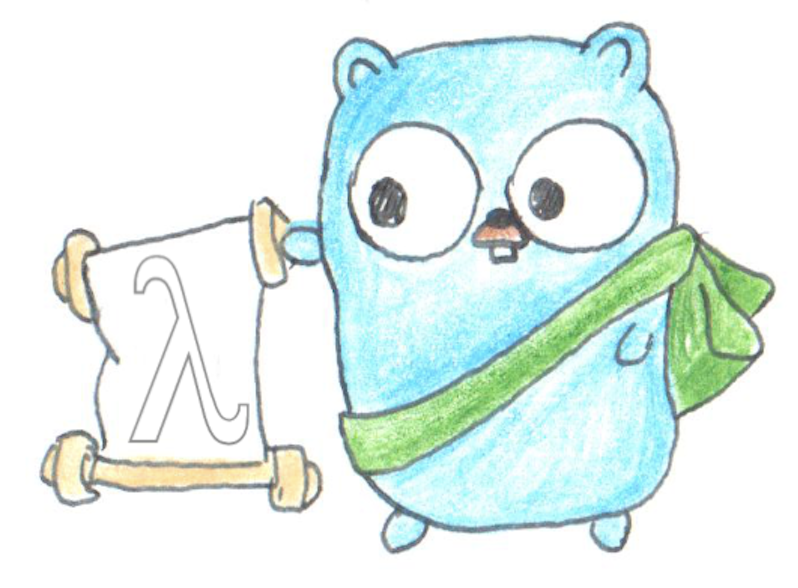

# Glojure


[Try it in your browser!](https://glojurelang.github.io/glojure/)



*Gopher image derived from [@egonelbre](https://github.com/egonelbre/gophers), licensed under [Creative Commons 1.0 Attributions license](https://creativecommons.org/licenses/by/1.0/).*

Glojure is an interpreter for
[Clojure](https://clojure.org/), hosted on Go. Glojure provides
easy access to Go libraries, similar to how Clojure provides easy
access to Java frameworks.

Glojure is in early development; expect bugs, missing features,
and limited performance. Backwards compatibility is not
guaranteed until a v1 release. That said, it is used successfully
in hobby projects and runs a significant subset of
the (transformed) core Clojure library.

Note that unlike most other Go implementations of Clojure, Glojure is
a "hosted" language - a term used to describe languages that are
implemented in terms of a host language (in this case, Go). This means
that all Go values can be used as Glojure values and vice versa.

## Prerequisites

Before you get started with Glojure, make sure you have installed
and have knowledge of Go (version 1.23 or higher).

## Installation

Glojure is currently available from source for all platforms where Go
can run, and it requires at least go 1.23.

Install it with the `go install` command:
```
$ go install github.com/glojurelang/glojure/cmd/glj@latest
```

After installation, you can start the REPL (Read-Eval-Print-Loop) with
the `glj` command:
```
$ glj
user=> (println "Hello, world!")
Hello, world!
nil
user=>
```

## Usage

Glojure can be used in two ways: as a standalone command-line tool (`glj`) or
embedded within Go applications.

### Using the `glj` Command

The `glj` command provides a traditional Clojure development experience:

**Show the help:**
```
$ glj --help   # or glj -h
```

**Show the version:**
```
$ glj --version
glojure v0.3.0
```

**Start a REPL (interactive session):**
```
user=> *glojure-version*
{:major 0, :minor 3, :incremental 0, :qualifier nil}
$ glj
user=> (+ 1 2 3)
6
user=> (println "Hello from Glojure!")
Hello from Glojure!
nil
```

**Evaluate expressions:**
```
$ glj -e '(println "Hello, World!")'
Hello, World!
$ glj -e '(apply + (range 3 10))'
42
$ glj -e '
(defn factorial [n] (if (<= n 1) 1 (* n (factorial (dec n)))))
(factorial 5)'
120
```

**Run a Clojure script:**
```clojure
;; hello.glj
(println "Hello," (first *command-line-args*))
```

```
$ glj hello.glj World
Hello, World
```

**Create executable programs:**
```clojure
;; server.glj
(ns example.server)

(defn echo-handler
  [w r]
  (io.Copy w (.Body r))
  nil)

(net:http.Handle "/" (net:http.HandlerFunc echo-handler))
(println "Server starting on :8080...")
(net:http.ListenAndServe ":8080" nil)
```

```
$ glj server.glj
Server starting on :8080...
```

### Embedding Glojure in Go Applications

You can also embed Glojure as a scripting language within your Go applications.
This is useful when you want to:
- Add scriptable configuration to your Go application
- Allow users to extend your application with Clojure plugins
- Mix Go's performance with Clojure's expressiveness
- Control the execution environment (custom I/O, sandboxing)

**Basic embedding example:**
```go
package main

import (
    "fmt"
    _ "github.com/glojurelang/glojure/pkg/glj"  // Initialize Glojure
    "github.com/glojurelang/glojure/pkg/runtime"
)

func main() {
    // Evaluate Clojure code
    result := runtime.ReadEval(`
        (defn factorial [n]
          (if (<= n 1)
            1
            (* n (factorial (dec n)))))
        (factorial 5)
    `)
    fmt.Printf("5! = %v\n", result) // 5! = 120
}
```

**Calling Go from Clojure and vice versa:**
```go
package main

import (
    "fmt"
    "github.com/glojurelang/glojure/pkg/glj"
    "github.com/glojurelang/glojure/pkg/runtime"
)

// Define a Go function
func greet(name string) string {
    return fmt.Sprintf("Hello, %s from Go!", name)
}

func main() {
    // Make the Go function available to Clojure
    runtime.ReadEval(`(def greet-from-go nil)`) // placeholder
    greetVar := glj.Var("user", "greet-from-go")
    greetVar.SetRoot(greet)

    // Use it from Clojure
    result := runtime.ReadEval(`(greet-from-go "Clojure")`)
    fmt.Println(result) // "Hello, Clojure from Go!"

    // Call a Clojure function from Go
    runtime.ReadEval(`(defn add [x y] (+ x y))`)
    addFn := glj.Var("user", "add")
    sum := addFn.Invoke(10, 32)
    fmt.Printf("Sum: %v\n", sum) // Sum: 42
}
```

**Accessing your own Go packages:**

When embedding Glojure, you can also expose your own Go packages or additional standard library packages using the package map approach described in the [Accessing additional Go packages](#accessing-additional-go-packages) section below. This allows embedded Clojure code to access any Go packages you choose to expose:

```go
import (
    _ "github.com/glojurelang/glojure/pkg/glj"
    _ "your.app/gljimports" // Your generated package map
)

// Now Clojure code can access your exposed packages
runtime.ReadEval(`
    (your$package.YourFunction "arg")
    (another$package.Method)
`)
```

### When to Use Each Approach

**Use `glj` command for:**
- Writing standalone Clojure programs
- Interactive development with the REPL
- Running Clojure scripts
- Evaluating expressions directly from the command line
- Learning Clojure with Go interop

**Embed Glojure for:**
- Adding scripting to an existing Go application
- Building a platform that users extend with Clojure
- Custom control over the Glojure execution environment
- Mixing Go and Clojure in a single binary

### Interop

Glojure ships with interop with many standard library packages
out-of-the-box.  Go package names are munged to avoid ambiguity with
the use of `/` to refer to namespaced symbols; instances of `/` in
package names are replaced with `:`. Here's a simple example:

```clojure
user=> (println (fmt.Sprintf "A couple of HTTP methods: %v" [net:http.MethodGet net:http.MethodPost]))
A couple of HTTP methods: ["GET" "POST"]
nil
```

The following standard library packages are included by default:
- `bytes`
- `context`
- `errors`
- `flag`
- `fmt`
- `io`
- `io/fs`
- `io/ioutil`
- `math`
- `math/big`
- `math/rand`
- `net/http`
- `os`
- `os/exec`
- `os/signal`
- `regexp`
- `reflect`
- `sort`
- `strconv`
- `strings`
- `sync`
- `sync/atomic`
- `time`
- `unicode`

To expose additional packages, you must generate a "package map" and compile your own executable
that imports both your package map and the Glojure API. See the section below for more details.

Expect improvements to both the availability of standard library packages and interop workflows.

#### Accessing additional Go packages

The `gen-import-interop` can be used to emit the contents of a .go file
that will export a function that can be used to add the exports of
additional packages to the Glojure package map.

```
$ go run github.com/glojurelang/glojure/cmd/gen-import-interop \
     -packages=:comma-separated-package-list: \
     > your/package/gljimports/my_package_map.go
```

Then, in your own program:

```go
package main

import (
	// Add your packages' exports to the pkgmap.
	_ "your.package/gljimports"
)

// ...
```

## Differences from Clojure

### Numbers

| Clojure Type | Glojure Type       | Notes |
| -----------  | -----------        | ----------- |
| `long`       | `int64`            | |
| `double`     | `float64`          | |
| `float`      | `float32`          | |
| `byte`       | `byte`             | Note that Go bytes are unsigned, whereas JVM bytes are signed. |
| `short`      | `int16`            | |
| `int`        | `int`              | Note that JVM ints are 32-bit, whereas Go ints are 32- or 64-bit depending on the platform. |
| `char`       | `lang.Char`       | The Glojure type is a tagged rune (`type Char rune`). JVM chars are 16-bit whereas Go runes are 32-bit. |
| `BigInt`     | `*lang.BigInt`     | The Glojure type wraps `*big.Int`. |
| `BigDecimal` | `*lang.BigDecimal` | The Glojure type wraps `*big.Float`. |
| `Ratio`      | `*lang.Ratio`      | The Glojure type wraps `*big.Rat`. |
| `BigInteger` | `*big.Int`         | Native JVM BigInteger corresponds to `*big.Int`. |


## Comparisons to other Go ports of Clojure

| Aspect      | Glojure | [Joker](https://github.com/candid82/joker) | [let-go](https://github.com/nooga/let-go) |
| ----------- | ----------- |----------- | -----------|
| Hosted[^1]  | Yes       | No  | No  |
| Extensible Go interop | Yes | No | No |
| Concurrency | Yes | Yes (with GIL) | Yes |
| Clojure tooling (e.g. linter) | No | Yes | No |
| Execution   | Tree-walk interpreter | Tree-walk interpreter  | Bytecode Interpreter |


*If you'd like to see another port in this table, or if you believe
there is an error in it, please file an issue or open a pull request!*

[^1]: What does it mean to be a hosted
language? For Clojure on the JVM, it means that all Java values are
also Clojure values, and vice versa. Glojure strives to maintain the
same relationship with Go.
